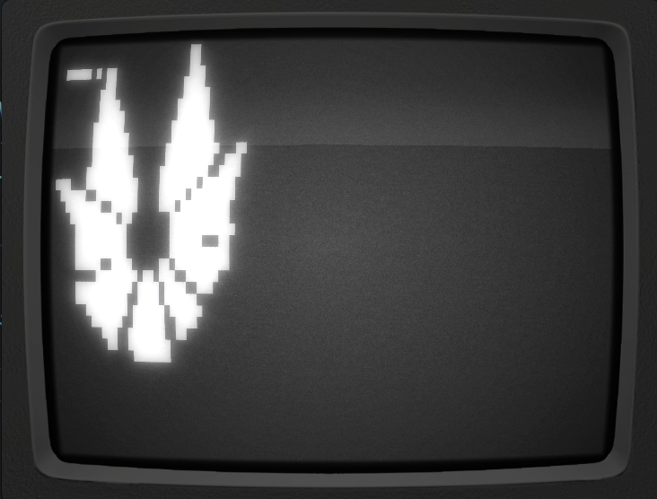
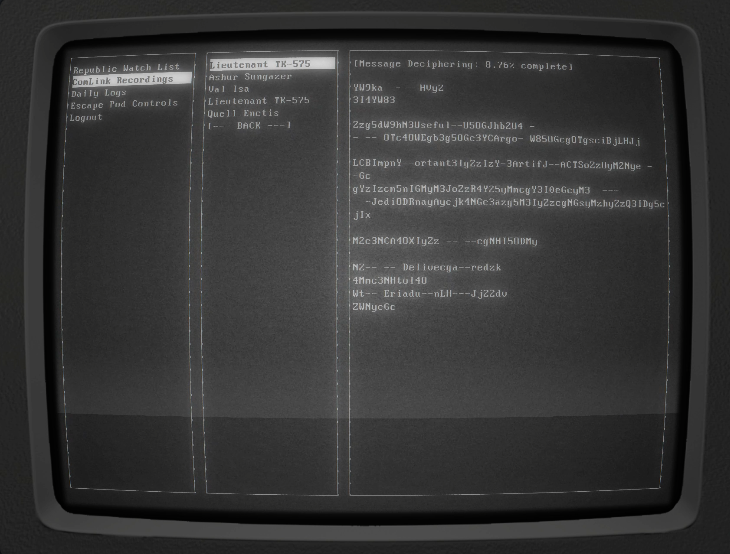
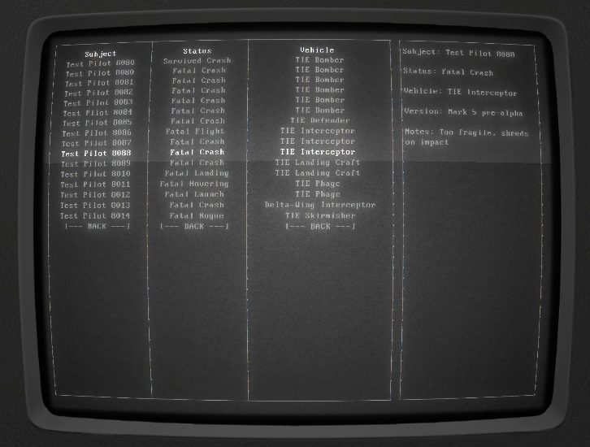

# SW:RPG Act-1 Sienar Console

Act 1 : Sienar Fleet Systems Advanced Projects Lab - Command Console

designed to be run in a terminal 28x98

A Console (prop) I made for the players of a SW:RPG Force and Destiny campaign. This console was in a control room in the Sienar Advanced Projects Laboratory, where the players broke out of their holding cells of the Test Pilot program. Sienar designs and builds new starships for the Imperial fleet, and were using people (our players) as test pilots in automated crash tests.

The players find out that Sienar is involved with crash testing, spying on private transmissions, and are watching Ashur Sungazer.

This part of the storyline hooks in to the first part of the "Lessons from the Past" adventure from the Force and Destiny Core Rule Book.

## Screenshots

## Video

https://youtu.be/1CZ9iIRyk0A

## Running the console

I recommend using [ Cool-Retro-Term ](https://github.com/Swordfish90/cool-retro-term)

have the latest stable version of `node` installed

clone this project, install dependencies `npm i`

run the app `node .`

[spacebar] to login

[arrow keys] to navigate

[return] to select options
